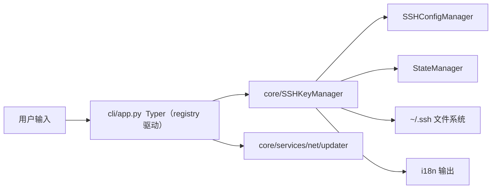
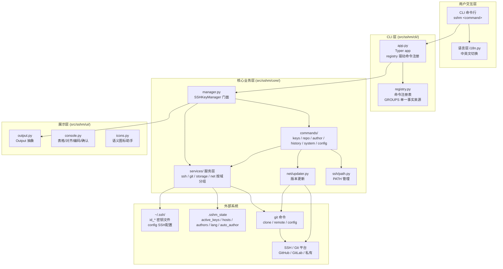

# 👨‍💻 开发者文档

面向开发者的架构说明、开发环境搭建与构建指南。

---

## 📋 目录

- [项目结构](#-项目结构)
- [架构设计](#-架构设计)
- [开发环境搭建](#-开发环境搭建)
- [测试](#-测试)
- [构建可执行文件](#-构建可执行文件)
- [CI/CD](#-cicd)
- [构建注意事项](#-构建注意事项)

---

## 📁 项目结构

```text
SSHManager/
├── src/
│   ├── run_sshm.py              # PyInstaller 入口点
│   └── sshm/
│       ├── __init__.py          # 包入口（自动初始化 Windows 控制台）
│       ├── __main__.py          # python -m sshm 入口
│       ├── constants.py         # 密钥类型等常量（版本号从 CHANGELOG 自动解析）
│       ├── i18n.py              # 国际化组装（翻译函数 + 语言状态）
│       ├── language/            # i18n 翻译字典（权威 key 模版 + EN/ZH）
│       │   ├── templates.py     # key 模版（KEYS 权威清单 + 分组约定）
│       │   ├── i18n_en.py       # 英文 (EN) 字典
│       │   ├── i18n_zh.py       # 中文 (ZH) 字典
│       │   └── __init__.py      # language 包导出
│       ├── cli/                 # CLI 层（Typer 参数解析 / 渲染）
│       │   ├── app.py           # Typer 命令定义（命令注册由 registry 驱动）
│       │   ├── registry.py      # 命令注册表（分组 / 命令名 / help_key 单一事实来源）
│       │   ├── suggest.py       # 未知命令 / 用法错误的模糊建议
│       │   └── __init__.py      # 导出 app
│       ├── ui/                  # 展示层
│       │   ├── output.py        # Output 抽象 + ConsoleOutput / NullOutput
│       │   ├── console.py       # 表格渲染 / 对齐 / 确认 / Windows 编码
│       │   ├── icons.py         # 语义图标翻译助手（ok/warn/tip/done/err）
│       │   └── tip.py           # 相关命令 tip / 错误提示模板渲染
│       ├── core/                # 业务核心层
│       │   ├── manager.py       # SSHKeyManager 门面（组合 services + commands）
│       │   ├── errors.py        # 业务异常（SSHMError / ValidationError）
│       │   ├── services/        # 服务层（按业务域分组）
│       │   │   ├── ssh/         # SSH 基础设施：keystore / config / path
│       │   │   ├── git/         # Git 域：gitrepo / author / rewrite
│       │   │   ├── storage/     # 持久化：state / backup
│       │   │   └── net/         # 网络与工具：sshtest / updater
│       │   └── commands/        # 命令编排层（按指令分包）
│       │       ├── keys.py      # KeyCommands：list/create/remove/rename/label/switch/current
│       │       ├── repo.py      # RepoCommands：use/clone/info/test
│       │       ├── author.py    # AuthorCommands：author 系列 + auto-author
│       │       ├── history.py   # HistoryCommands：rewrite
│       │       └── system.py    # SystemCommands：language/auto-author/update
├── scripts/
│   ├── build_local.py           # 本地构建脚本
│   ├── check_all.py             # 提交前统一检查（compile/i18n/pytest/pyright）
│   ├── hooks/                   # git pre-commit 钩子模板 + 安装脚本
│   ├── install.ps1              # Windows 一键安装
│   └── install.sh               # Linux/macOS 一键安装
├── tests/                       # pytest 测试套件（含 i18n 守门测试）
├── .github/workflows/
│   └── build-release.yml        # 三平台打包发布
└── docs/                        # 项目文档
```

---

## 🏗️ 架构设计

### 分层结构

- **cli 层**：交互适配（Typer 参数解析 / 命令注册表驱动），只负责翻译用户意图并调用门面；命令注册由 `cli/registry.py` 的 `GROUPS` 单一事实来源驱动（`cli/app.py` 用 `_cmd` 装饰器取 help_key、`_show_tip` 自动反查分组）
- **ui 层**：展示（`Output` 抽象 + 终端渲染），核心层只依赖 `Output` 抽象，可替换为 JSON/GUI/静默实现
- **core 层**：纯业务逻辑，不依赖 CLI
  - 服务（按业务域分组于 `services/`）：`ssh/`（KeyStore / SSHConfigManager / path）、`git/`（GitRepoService / AuthorService / rewrite）、`storage/`（StateManager / BackupService）、`net/`（SSHTester / UpdateManager）；业务异常 `errors` 留在 `core/` 顶层
  - 门面：`SSHKeyManager`（组合服务，公开 API 委托到服务与命令编排组）
  - 命令编排：`commands/`（keys / repo / author / history / system，按指令分包，每模块单一职责）
- **language 层**：i18n 翻译字典（`i18n_en.py`/`i18n_zh.py` + key 模版），`i18n.py` 组装翻译函数

> 核心采用**组合 + 门面模式**：`SSHKeyManager` 组合各服务类（而非继承），命令编排组持门面引用；依赖方向单向：`cli → core → ui`。

**相关命令跨组关联（声明式）**：命令的 tip 由 `registry.related_commands` 推导——命令可在 `CommandMeta(..., related=("命令名",))` 声明**跨分组关联**（命令名全局查找），如 `key switch` 声明 `related=("use",)` 关联 `repo use`（为仓库配置密钥）。缺参/用法错误与正常执行后的 tip 共用同一推导逻辑，保证一致。相关命令按「本组命令」与「跨组 related 命令」分块展示（标题 `More commands in this group` / `More related commands`，见 `ui.tip.related_command_blocks`）。新增跨组关联只需在注册表声明 `related`，无需改动渲染逻辑。

### 国际化 (i18n)

- **稳定 key 方案**：翻译键为稳定 key（如 `cmd.list` / `opt.label`），英文（`EN`）与中文（`ZH`）两套字典都映射到同一 key，杜绝"改描述要改两处"与废弃键冗余
- 字典按语言拆分为独立文件（`language/i18n_en.py` / `i18n_zh.py`），通用 key 模版（`language/templates.py`）持有权威 `KEYS` 清单
- 语言优先级：`SSHM_LANG` 环境变量 > 状态文件 `lang` 字段 > 默认 `en`
- 翻译函数 `_(key, **kwargs)`：按当前语言查表，支持 `{placeholder}` 格式化；缺失时回退英文，再缺失回退 key 本身便于发现遗漏
- **一致性守门**：`tests/test_i18n.py` 自动校验 key 模版 / EN / ZH 三方同步、翻译非空、占位符一致

### 数据流



### 完整架构图

> 独立文件见 [architecture.mmd](architecture.mmd)，下方为可渲染版本。



---

## 💻 开发环境搭建

### 前置要求

- **Python 3.14+**（同时兼容 3.11+）
- Git

### 步骤

```bash
git clone https://github.com/eavelabs-community/sshm.git
cd SSHManager
pip install -e .            # 安装运行时依赖（typer / wcwidth）
pip install -e ".[dev]"     # 安装开发依赖（pytest / basedpyright / pyinstaller）
```

### 本地运行

```bash
# 命令行方式
PYTHONPATH=src python -m sshm key list

# 查看顶层帮助（含全部分组）
PYTHONPATH=src python -m sshm --help
```

---

## 🧪 测试

基于 pytest 的统一测试套件（`tests/`，205+ 用例），包含核心业务、CLI 帮助、i18n 一致性守门测试等。

```bash
# 运行全部测试
python -m pytest

# 并行加速（pytest-xdist，可选）
python -m pytest -n 3

# 提交前统一检查（compile + i18n + pytest + pyright，任一失败阻断提交）
python scripts/check_all.py
```

> git pre-commit 钩子默认会在 `git commit` 前自动运行 `check_all.py`。
> 安装钩子：`python scripts/hooks/install.py`，详见 [HOOKS.md](../scripts/HOOKS.md)。

---

## 🔨 构建可执行文件

### 本地构建

```bash
python scripts/build_local.py
```

推荐使用仓库内 `sshm.spec`（已配置 `_version.txt` + `CHANGELOG.md` 的 datas 与瘦身 excludes，与 CI 完全一致，exe 版本才能正确解析）：

```bash
pyinstaller sshm.spec
```

等价命令行（**不推荐**：不含版本文件 datas，exe 版本会回落 `0.0.0`）：

```bash
pyinstaller --onefile --name sshm --console --paths src src/run_sshm.py
```

构建产物：`dist/sshm.exe`（Windows）或 `dist/sshm`（Linux/macOS）

### 验证

```bash
./dist/sshm --help
./dist/sshm key list
```

---

## 🤖 CI/CD

`.github/workflows/build-release.yml` 会在推送 `v*` 标签时触发：

1. 在 Windows / Linux / macOS 三平台分别构建单文件可执行文件
2. 运行 `--help` 冒烟测试
3. 上传构建产物
4. 自动创建 GitHub Release 并附带三平台安装包

触发方式：

```bash
git tag v0.0.3
git push origin v0.0.3
```

---

## ⚠️ 构建注意事项

1. **入口文件使用绝对导入**：`run_sshm.py` 必须用 `from sshm.xxx import ...` 形式，确保 PyInstaller 静态分析正确。
2. **避免 f-string 跨行/表达式内反斜杠**：此类写法仅 Python 3.12+（PEP 701）支持。项目以 Python 3.14 构建，但为兼容性，建议将复杂表达式先算到变量再放入 f-string。
3. **模块未被打包时的现象**：若 PyInstaller 因模块导入失败将其标记为 `invalid`，运行时会出现 `ModuleNotFoundError`。可检查 `build/sshm/warn-sshm.txt` 中的 `invalid module named ...`。
4. **清理缓存**：修改源码后务必删除 `build/` 目录再重建，否则 PyInstaller 可能复用旧分析结果：
   ```bash
   rm -rf build dist
   pyinstaller sshm.spec
   ```
